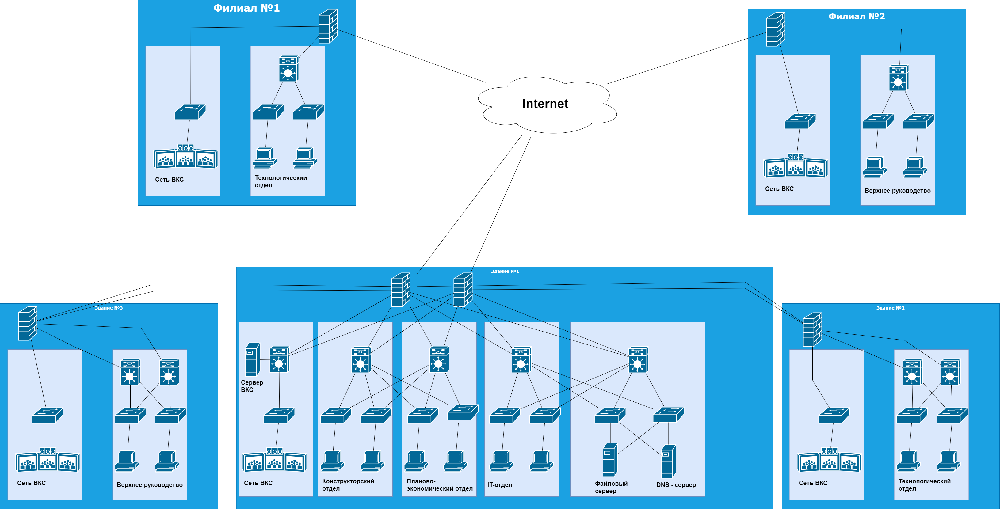

# Исследование существующей сети предприятия.
На данный момент сеть предприятия охватывает три здания, расположенных недалеко друг от друга. Между зданиями проложена ВОЛС. В каждом здании используется роутер, а также коммутаторы L3 и L2. 

Для всех отделов предприятия выделено свое адресное пространство. В предприятии используется сеть ВКС, в каждом из зданий есть
терминалы. Сервер ВКС находится в здании №1.
В главном здании (№1) расположена серверная ферма (сервер приложений, файловый сервер).
На роутерах настроены ACL для разграничения прав доступа к сети ВКС. К данной сети имеют доступ только IT-персонал 
предприятия, также разрешено сетевой взаимодействие между сетью ВКС и файловым сервером.

Предприятие активно развивается, поэтому необходимо модернизировать сеть. Повысить ее отказоустойчивость, предоставить пользователям выход в Интернет,
а также организовать взаимодействие с удаленными филиалами. Из-за увеличения количества устройств необходимо уйти от статической 
маршрутизации и статической IP-адресации.

**Общая таблица сетей.**

| Network IPv4     | Description                     | VLAN                |
|-----------------:|:--------------------------------|--------------------:|
| 172.16.0.0/21    | Summury network                 |                     |  
| 172.16.0.0/24    | Management                      | 55                  |
| 172.16.1.0/25    | SERVERS                         | 10                  | 
| 172.16.1.128/25  | Department IT                   | 20                  |
| 172.16.2.0/24    | Engineering department          | 30                  |
| 172.16.3.0/24    | Planning and Economic Department| 40                  | 
| 172.16.4.0/24    | Technology department           | 60                  | 
| 172.16.5.0/24    | Administration                  | 50                  |
| 172.16.6.0/24    | Резерв.                         |                     | 
| 172.16.7.0/24    | Резерв.                         |                     | 
| 10.10.10.0/25    | Суммарная сеть ВКС              |                     | 
| 10.10.10.0/28    | Сеть ВКС зд.1                   |                     | 
| 10.10.10.16/28   | Сеть ВКС зд.2                   |                     | 
| 10.10.10.32/28   | Сеть ВКС зд.3                   |                     | 
| 10.10.10.128/25  | Сети Point-to-Point             |                     |  

**Сети Point-To-Point**

| host | Port  | IPv4 address |   Network       | Description  |
|------|-------|--------------|-----------------|--------------|
| R1   | e0/0  | 10.10.10.133 | 10.10.10.132/30 | to SW1 e0/0  |   
| R1   | e0/1  | 10.10.10.129 | 10.10.10.128/30 | to SW2 e0/0  |   
| R1   | e0/3  | 10.10.10.153 | 10.10.10.152/30 | to SW4 e0/0  |  
| R1   | e1/0  | 10.10.10.142 | 10.10.10.140/30 | to R2 e0/0   |  
| R1   | e1/1  | 10.10.10.149 | 10.10.10.148/30 | to R2 e0/0   |    
| R2   | e0/0  | 10.10.10.141 | 10.10.10.140/30 | to R1 e1/0   |    
| R2   | e0/1  | 10.10.10.138 | 10.10.10.136/30 | to SW21 e0/0 |
| R3   | e0/0  | 10.10.10.150 | 10.10.10.148/30 | to R1 e1/1   |
| R3   | e0/1  | 10.10.10.145 | 10.10.10.144/30 | to SW31 e0/0 |
| SW1  | e0/0  | 10.10.10.134 | 10.10.10.132/30 | to R1 e0/0   |
| SW2  | e0/0  | 10.10.10.130 | 10.10.10.128/30 | to R1 e0/1   |
| SW4  | e0/0  | 10.10.10.154 | 10.10.10.152/30 | to R1 e0/3   |
| SW21 | e0/0  | 10.10.10.137 | 10.10.10.136/30 | to R2 e0/1   |
| SW31 | e0/0  | 10.10.10.146 | 10.10.10.144/30 | to R3 e0/1   |
