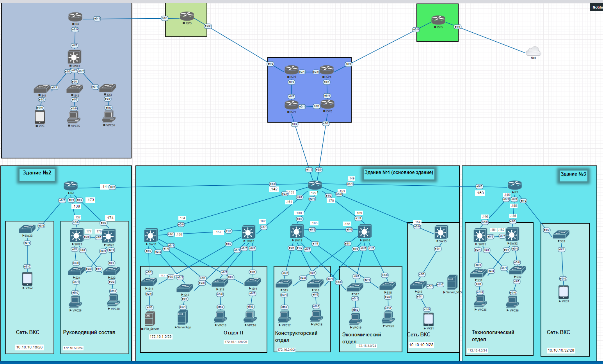
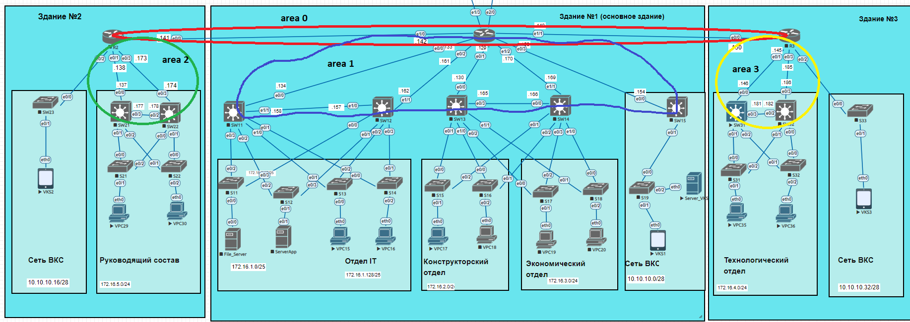

# Модернизация сети предприятия.
После модернизации сеть предприятия охватывает три здания в рамках одного города, расположенных недалеко друг от друга, а также 2 филиала в удаленных городах.

Для всех отделов предприятия выделено свое адресное пространство. В предприятии используется сеть ВКС, в каждом из зданий есть
терминалы. Сервер ВКС находится в здании №1.
В главном здании (№1) расположена серверная ферма (сервер приложений, файловый сервер). 
Для обеспечения отказоустойчивости коммутаторы доступа подключены к двум разным коммутаторам уровня агрегации (используется протокол GLBP), которые в свою очередь связаны между собой линком L3. В каждом сегменте сети на коммутаторах уровня агрегации работает DHCP сервер. Маршрутизация выполнена на основе многозонного OSPF, схема представлена на рисунке ниже:  

**Общая таблица сетей.**

| Network IPv4     | Description                     | VLAN                |
|-----------------:|:--------------------------------|--------------------:|
| 172.16.0.0/21    | Summury network                 |                     |  
| 172.16.0.0/24    | Management                      | 55                  |
| 172.16.1.0/25    | SERVERS                         | 10                  | 
| 172.16.1.128/25  | Department IT                   | 20                  |
| 172.16.2.0/24    | Engineering department          | 30                  |
| 172.16.3.0/24    | Planning and Economic Department| 40                  | 
| 172.16.4.0/24    | Technology department           | 60                  | 
| 172.16.5.0/24    | Administration                  | 50                  |
| 172.16.6.0/24    | Резерв.                         |                     | 
| 172.16.7.0/24    | Резерв.                         |                     | 
| 10.10.10.0/25    | Суммарная сеть ВКС              |                     | 
| 10.10.10.0/28    | Сеть ВКС зд.1                   |                     | 
| 10.10.10.16/28   | Сеть ВКС зд.2                   |                     | 
| 10.10.10.32/28   | Сеть ВКС зд.3                   |                     | 
| 10.10.10.128/25  | Сети Point-to-Point             |                     |  

**Сети Point-To-Point**

| host | Port  | IPv4 address |   Network       | Description  |
|------|-------|--------------|-----------------|--------------|
| R1   | e0/0  | 10.10.10.133 | 10.10.10.132/30 | to SW11 e0/0 |   
| R1   | e0/1  | 10.10.10.129 | 10.10.10.128/30 | to SW13 e0/0 |
| R1   | e0/2  | 10.10.10.161 | 10.10.10.160/30 | to SW12 e1/1 |
| R1   | e0/3  | 10.10.10.153 | 10.10.10.152/30 | to SW4 e0/0  |  
| R1   | e1/0  | 10.10.10.142 | 10.10.10.140/30 | to R2 e0/0   |  
| R1   | e1/1  | 10.10.10.149 | 10.10.10.148/30 | to R2 e0/0   | 
| R1   | e1/2  | 10.10.10.170 | 10.10.10.168/30 | to SW14 e1/1 |
| R1   | e1/3  | 10.10.10.??? | 10.10.10.128/30 | to ISP1 e0/2 |
| R1   | e1/3  | 10.10.10.??? | 10.10.10.128/30 | to ISP2 e0/2 |
| R2   | e0/0  | 10.10.10.141 | 10.10.10.140/30 | to R1 e1/0   |    
| R2   | e0/1  | 10.10.10.138 | 10.10.10.136/30 | to SW21 e0/0 |
| R2   | e0/3  | 10.10.10.173 | 10.10.10.172/30 | to SW22 e0/3 |
| R3   | e0/0  | 10.10.10.150 | 10.10.10.148/30 | to R1 e1/1   |
| R3   | e0/1  | 10.10.10.145 | 10.10.10.144/30 | to SW31 e0/0 |
| R3   | e0/3  | 10.10.10.185 | 10.10.10.184/30 | to SW32 e0/3 |
| SW11 | e0/0  | 10.10.10.134 | 10.10.10.132/30 | to R1 e0/0   |
| SW11 | e1/1  | 10.10.10.158 | 10.10.10.156/30 | to SW12 e1/0 |
| SW12 | e1/0  | 10.10.10.157 | 10.10.10.156/30 | to SW11 e1/1 |
| SW12 | e1/1  | 10.10.10.162 | 10.10.10.160/30 | to R1 e0/2   |
| SW13 | e0/0  | 10.10.10.130 | 10.10.10.128/30 | to R1 e0/1   |
| SW13 | e0/3  | 10.10.10.165 | 10.10.10.164/30 | to SW14 e0/0 |
| SW14 | e1/1  | 10.10.10.169 | 10.10.10.168/30 | to R1 e1/2   |
| SW14 | e0/0  | 10.10.10.166 | 10.10.10.164/30 | to SW13 e0/3 |
| SW15 | e0/0  | 10.10.10.154 | 10.10.10.152/30 | to R1 e0/3   |
| SW21 | e0/0  | 10.10.10.137 | 10.10.10.136/30 | to R2 e0/1   |
| SW21 | e0/3  | 10.10.10.177 | 10.10.10.176/30 | to SW22 e0/2 |
| SW22 | e0/2  | 10.10.10.178 | 10.10.10.176/30 | to SW21 e0/3 |
| SW22 | e0/3  | 10.10.10.174 | 10.10.10.172/30 | to R2 e0/3   |
| SW31 | e0/0  | 10.10.10.146 | 10.10.10.144/30 | to R3 e0/1   |
| SW31 | e0/3  | 10.10.10.181 | 10.10.10.180/30 | to SW32 e0/2 |
| SW32 | e0/2  | 10.10.10.182 | 10.10.10.180/30 | to SW31 e0/3 |
| SW32 | e0/3  | 10.10.10.186 | 10.10.10.184/30 | to R3 e0/3   |
