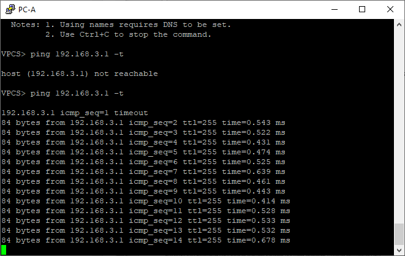

# Лабораторная работа. Внедрение маршрутизации между виртуальными локальными сетями
## Задачи
**1. Создание сети и настройка основных параметров устройства** 

**2. Создание сетей VLAN и назначение портов коммутатора**  

**3. Настройка транка 802.1Q между коммутаторами.** 

**4. Настройка маршрутизации между сетями VLAN**  

**5. Проверка, что маршрутизация между VLAN работает**  
  
    
     
      
  ***Таблица адресации*** 
  
  
| Устройство |Интерфейс     | IP-адрес      | Маска подсети  | Шлюз по умолчанию|
|------------|--------------|---------------|----------------|------------------|
|    R1      | E 0/1.3      | 192.168.3.1   |255.255.255.0   |        -         |
|            | E 0/1.4      | 192.168.4.1   |255.255.255.0   |        -         |
|            | E 0/1.8      | -             |  -             |        -         |
|    S1      | VLAN 3       | 192.168.3.11  |255.255.255.0   |    192.168.3.1   |
|    S2      | VLAN 3       | 192.168.3.12  |255.255.255.0   |    192.168.3.1   |
|    PC0     | NIC          | 192.168.3.3   |255.255.255.0   |    192.168.3.1   |
|    PC1     | NIC          | 192.168.4.3   |255.255.255.0   |    192.168.4.1   | 
  
  

***Таблица VLAN***      
  

|      VLAN     |    Имя          |   Назначенный интерфейс     | 
|---------------|-----------------|-----------------------------|
|   3           |Management       |  S1: VLAN 3                 |
|               |                 |  S2: VLAN 3                 |
|   4           |Operations       |  S2: E0/1                   |
|   7           |Parking_Lot      |  S1: E0/3 |
|               |                 |  S2: F0/2-3|
            
               


## Ход выполнения работы    
### 1. Создание сети и настройка основных параметров устройств    
Для выполнения работы создадим сеть согласно топологии    
    

Настройку выполним на примере SW1.
Войдем в режим глобальной конфигурации:  
``` 
Switch>enable
Switch#conf t
``` 
Назначим имя устройства:  
``` 
Switch(config)#hostname SW1
``` 
Отключим поиск DNS: 
```   
SW1(config)#no ip domain-lookup
```   
Назначим пароли на привелигированный режим, пароль консоли и пароль виртуального терминала, после чего зашифруем открытые пароли: 
```
SW1(config)#enable secret class
SW1(config)#line con 0
SW1(config-line)#password cisco
SW1(config-line)#login
SW1(config-line)#logging synchronous
SW1(config-line)#exit
SW1(config)#line
SW1(config)#line vty 0 4
SW1(config-line)#password cisco
SW1(config-line)#login
SW1(config-line)#exit   
SW1(config)#service password-encryption
``` 
Создадим баннер и сохраним конфигурацию:  
```
SW1(config)#banner motd #Attention! This is a private space!Unauthorized access is prohibited!#   
SW1(config)#exit  
SW1#wr
``` 
Настроим время на устройстве: 
``` 
SW1# clock set 21:10:55 16 February 2022  
``` 

Результат настройки базовых конфигураций можно посмотреть тут - [R1](config/base_setting_R1), [S1](config/base_setting_S1), [S2](config/base_setting_S1). 

Настройка PC-A:     
```
VPCS> ip 192.168.3.3/24 192.168.3.1
Checking for duplicate address...
PC1 : 192.168.3.3 255.255.255.0 gateway 192.168.3.1
``` 
и PC-B: 
``` 
VPCS> ip 192.168.4.3/24 192.168.4.1
Checking for duplicate address...
PC1 : 192.168.4.3 255.255.255.0 gateway 192.168.4.1

VPCS> save
``` 
  
### 2. Создание сети и настройка основных параметров устройств    
#### 2.1 Создание сети VLAN на коммутаторах   
Создадим и назовем необходимые VLAN на каждом коммутаторе в соответствие с таблицей.
Настроим интерфейс управления и шлюз по умолчанию на каждом коммутаторе. 
Назначим все неиспользуемые порты коммутатора VLAN Parking_Lot, настроим их для статического режима доступа и административно деактивируем их:       
``` 
SW1(config)#vlan 3
SW1(config-vlan)#name MANAGEMENT
SW1(config-vlan)#exit
SW1(config)#vlan 7
SW1(config-vlan)#name PARKING_LOT
SW1(config-vlan)#exi
SW1(config)#vlan 8
SW1(config-vlan)#name NATIVE
SW1(config-vlan)#exit
SW1(config)#int vlan 3
SW1(config-if)#ip address 192.168.3.11 255.255.255.0
SW1(config-if)#exit
SW1(config)#ip default-gateway 192.168.3.1
SW1(config)#int ethernet 0/1
SW1(config)#int e 0/3
SW1(config-if)#swi mod ac
SW1(config-if)#swi acc vlan 7
SW1(config-if)#shutdown
SW1(config-if)#exit
SW1(config)#
```   
#### 2.2 Назначьте сети VLAN соответствующим интерфейсам коммутатора    
Назначим используемые порты соответствующей VLAN (указанной в таблице VLAN выше) и настроим их для режима статического доступа: 
``` 
SW1(config)#int ethernet 0/1
SW1(config-if)#switchport mode access
SW1(config-if)#sw acc vlan 3
SW1(config-if)#exit 
```   

Убедимся, что все VLAN назначены правильно: 
  

Также проверим и для SW2: 
    


### 3. Конфигурация магистрального канала стандарта 802.1Q между коммутаторами    
#### 3.1  Вручную настроим магистральный интерфейс F0/1 на коммутаторах S1 и S2.    
Настроим статический транкинг на интерфейсе e0/0 для обоих коммутаторов.     
Установим native VLAN 8 на обоих коммутаторах    
Укажем, что VLAN 3,4,8 могут проходить по транку   
```
SW1(config)#int e0/2
SW1(config-if)#switchport trunk encapsulation dot1q
SW1(config-if)#switchport mode trunk
SW1(config-if)#switchport trunk allowed vlan 3,4,8
SW1(config-if)#switchport trunk native vlan 8
SW1(config-if)#exit
``` 

Проверим транки, native VLAN и разрешенные VLAN через транк.    
Используем команду *show interfaces trunk*  
 
 

#### 3.2  Вручную настроим магистральный интерфейс e0/2 на коммутаторе S1     
```
SW1(config)#int e0/2
SW1(config-if)#switchport trunk encapsulation dot1q
SW1(config-if)#switchport mode trunk
SW1(config-if)#switchport trunk allowed vlan 3,4,8
SW1(config-if)#switchport trunk native vlan 8
SW1(config-if)#exit 
```

### 4. Настройка маршрутизации между сетями VLAN    
Настроим подинтерфейсы для каждой VLAN, как указано в таблице     
```
R1(config)#int e0/0.3
R1(config-subif)# encapsulation dot1Q 3
R1(config-subif)#ip address 192.168.3.1 255.255.255.0
R1(config-subif)#exit
R1(config)#int e0/0.4
R1(config-subif)#encapsulation dot1Q 4
R1(config-subif)#ip address 192.168.4.1 255.255.255.0
R1(config-subif)#exit
R1(config)#int e0/0.8
R1(config-subif)#encapsulation dot1Q 8 native
R1(config-subif)#exit  
```   
Полную конфигурацию устройства можно посмотреть [здесь](config/config_R1)   

### 5. Проверим работу маршрутизации между VLAN     
***a)***	Отправьте эхо-запрос с PC-A на шлюз по умолчанию. 

***b)***	Отправьте эхо-запрос с PC-A на PC-B.  

***c)***	Отправьте команду ping с компьютера PC-A на коммутатор S2.  

Результат:    

   


