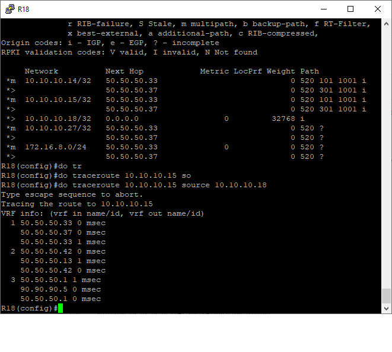

# Лабораторная работа №10
     
       
**Сети Point-To-Point**


| host | Port  | IPv4 address |   Network       |    IPv6 address             | IPv6 LL address | Description  |
|------|-------|--------------|-----------------|-----------------------------|-----------------|--------------|
| R12  | e0/0  |              |                 |20FF:AAAA:BBBB:A1::0012:0/64 |  FE80::12       |              |   
| R12  | e0/1  | 172.16.10.37 | 172.16.10.36/30 |20FF:AAAA:BBBB:A1::0012:1/64 |  FE80::12       | to R13 e0/1  |   
| R12  | e0/2  | 172.16.10.1  | 172.16.10.0/30  |20FF:AAAA:BBBB:A1::0012:2/64 |  FE80::12       | to R14 e0/0  |  
| R12  | e0/3  | 172.16.10.5  | 172.216.10.4/30 |20FF:AAAA:BBBB:A1::0012:3/64 |  FE80::12       | to R15 e0/1  |  
| R13  | e0/0  |              |                 |20FF:AAAA:BBBB:A1::0013:0/64 |  FE80::13       |              |    
| R13  | e0/1  | 172.16.10.38 | 172.16.10.36/30 |20FF:AAAA:BBBB:A1::0013:1/64 |  FE80::13       | to R12 e0/1  |    
| R13  | e0/2  | 172.16.10.9  | 172.16.10.8/30  |20FF:AAAA:BBBB:A1::0013:2/64 |  FE80::13       | to R15 e0/0  |  
| R13  | e0/3  | 172.16.10.13 | 172.16.10.12/30 |20FF:AAAA:BBBB:A2::0013:3/64 |  FE80::13       | to R14 e0/1  |  
| R14  | e0/0  | 172.16.10.2  | 172.16.10.0/30  |20FF:AAAA:BBBB:A1::0014:0/64 |  FE80::14       | to R12 e0/2  |  
| R14  | e0/1  | 172.16.10.14 | 172.16.10.12/30 |20FF:AAAA:BBBB:A2::0014:1/64 |  FE80::14       | to R13 e0/3  |    
| R14  | e0/2  | 90.90.90.1   | 90.90.90.0 /30  |20FF:1111:1111:A1::0014:2/64 |  FE80::14       | to R22 e0/0  | -> Kitorn
| R14  | e0/3  | 172.16.10.17 | 172.16.10.16/30 |20FF:AAAA:BBBB:A3::0014:3/64 |  FE80::14       | to R19 e0/0  |
| R14  | e1/0  | 172.16.10.41 | 172.16.10.40/30 |20FF:AAAA:BBBB:A4::0014:4/64 |  FE80::14       | to R15 e1/0  |
| R15  | e0/0  | 172.16.10.10 | 172.16.10.8/30  |20FF:AAAA:BBBB:A1::0015:0/64 |  FE80::15       | to R13 e0/2  |  
| R15  | e0/1  | 172.16.10.6  | 172.16.10.4/30  |20FF:AAAA:BBBB:A2::0015:1/64 |  FE80::15       | to R12 e0/3  |  
| R15  | e0/2  | 90.90.90.5   | 90.90.90.4/30   |20FF:1111:1111:A1::0015:2/64 |  FE80::15       | to R21 e0/0  | -> Lamas
| R15  | e0/3  | 172.16.10.21 | 172.16.10.20/30 |20FF:AAAA:BBBB:A3::0015:3/64 |  FE80::15       | to R20 e0/0  |  
| R15  | e1/0  | 172.16.10.42 | 172.16.10.40/30 |20FF:AAAA:BBBB:A4::0015:4/64 |  FE80::14       | to R19 e0/0  |
| R16  | e0/0  |              |                 |20FF:BBBB:BBBB:A1::0016:0/64 |  FE80::16       |              |   
| R16  | e0/1  | 172.16.10.25 | 172.16.10.24/30 |20FF:BBBB:BBBB:A1::0016:1/64 |  FE80::16       | to R18 e0/0  | 
| R16  | e0/2  |              |                 |20FF:BBBB:BBBB:A1::0016:2/64 |  FE80::16       |              |  
| R16  | e0/3  | 172.16.10.29 | 172.16.10.28/30 |20FF:BBBB:BBBB:A1::0016:3/64 |  FE80::16       | to R32 e0/0  |
| R16  | e1/0  | 172.16.10.34 | 172.16.10.32/30 |20FF:BBBB:BBBB:A1::0016:4/64 |  FE80::16       | to R17 e0/3  |
| R17  | e0/0  |              |                 |20FF:BBBB:BBBB:A1::0017:0/64 |  FE80::17       |              |    
| R17  | e0/1  | 172.16.10.29 | 172.16.10.28/30 |20FF:BBBB:BBBB:A1::0017:1/64 |  FE80::17       | to R18 e0/1  |    
| R17  | e0/2  |              |                 |20FF:BBBB:BBBB:A1::0017:2/64 |  FE80::17       |              |
| R17  | e0/3  | 172.16.10.33 | 172.16.10.32/30 |20FF:BBBB:BBBB:A1::0017:3/64 |  FE80::17       | to R16 e1/0  |
| R18  | e0/0  | 172.16.10.26 | 172.16.10.24/30 |20FF:BBBB:BBBB:A1::0018:0/64 |  FE80::18       | to R16 e0/1  |    
| R18  | e0/1  | 172.16.10.30 | 172.26.10.28/30 |20FF:BBBB:BBBB:A1::0018:1/64 |  FE80::18       | to R17 e0/1  |  
| R18  | e0/2  | 50.50.50.38  | 50.50.50.36/30  |20FF:BBBB:BBBB:A1::0018:2/64 |  FE80::18       | to R24 e0/3  |   
| R18  | e0/3  | 50.50.50.34  | 50.50.50.32/30  |20FF:BBBB:BBBB:A2::0018:3/64 |  FE80::18       | to R26 e0/3  |  
| R19  | e0/0  | 172.16.10.18 | 172.26.10.16/30 |20FF:AAAA:BBBB:A3::0019:/64  |  FE80::19       | to R14 e0/3  |  
| R20  | e0/0  | 172.16.10.22 | 172.26.10.20/30 |20FF:AAAA:BBBB:A3::0020:1/64 |  FE80::20       | to R15 e0/3  |  
| R21  | e0/0  | 90.90.90.6   | 90.90.90.4/30   |20FF:1111:1111:A1::0021:0/64 |  FE80::21       | to R15 e0/2  |  
| R21  | e0/1  | 90.90.90.9   | 90.90.90.8/30   |20FF:1111:1111:A2::0021:1/64 |  FE80::21       | to R22 e0/1  | 
| R21  | e0/2  | 90.90.90.13  | 90.90.90.12/30  |20FF:1111:1111:A3::0021:2/64 |  FE80::21       | to R24 e0/0  |  
| R22  | e0/0  | 90.90.90.2   | 90.90.90.0/30   |20FF:1111:1111:A1::0022:0/64 |  FE80::22       | to R14 e0/2  |  
| R22  | e0/1  | 90.90.90.10  | 90.90.90.8/30   |20FF:1111:1111:A2::0022:1/64 |  FE80::22       | to R21 e0/1  |  
| R22  | e0/2  | 50.50.50.42  | 50.50.50.40/30  |20FF:1111:1111:A4::0022:2/64 |  FE80::22       | to R23 e0/0  |  
| R23  | e0/0  | 50.50.50.18  | 50.50.50.16/30  |20FF:1111:1111:A4::0023:0/64 |  FE80::23       | to R22 e0/2  |  
| R23  | e0/1  | 50.50.50.1   | 50.50.50.0/30   |20FF:1111:1111:A1::0023:1/64 |  FE80::23       | to R25 e0/0  |  
| R23  | e0/2  | 50.50.50.5   | 50.50.50.4/30   |20FF:1111:1111:A2::0023:2/64 |  FE80::23       | to R24 e0/2  |  
| R24  | e0/0  | 50.50.50.41  | 50.50.50.40/30  |20FF:1111:1111:A1::0024:0/64 |  FE80::24       | to R21 e0/2  |  
| R24  | e0/1  | 50.50.50.9   | 50.50.50.8/30   |20FF:1111:1111:A3::0024:1/64 |  FE80::24       | to R26 e0/0  |  
| R24  | e0/2  | 50.50.50.6   | 50.50.50.4/30   |20FF:1111:1111:A2::0024:2/64 |  FE80::24       | to R23 e0/2  |  
| R24  | e0/3  | 50.50.50.37  | 50.50.50.36/30  |20FF:BBBB:BBBB:A1::0024:3/64 |  FE80::24       | to R18 e0/2  |  
| R25  | e0/0  | 50.50.50.2   | 50.50.50.0/30   |20FF:1111:1111:A1::0025:0/64 |  FE80::25       | to R23 e0/1  |  
| R25  | e0/1  | 50.50.50.21  | 50.50.50.20/30  |20FF:1111:1111:A27::0025:1/64 |  FE80::25       | to R27 e0/0  |  
| R25  | e0/2  | 50.50.50.13  | 50.50.50.12/30  |20FF:1111:1111:A26::0025:2/64 |  FE80::25       | to R26 e0/2  |  
| R25  | e0/3  | 50.50.50.25  | 50.50.50.24/30  |20FF:1111:1111:A25::0025:3/64 |  FE80::25       | to R28 e0/1  |  
| R26  | e0/0  | 50.50.50.10  | 50.50.50.8/30   |20FF:1111:1111:A3::0026:0/64 |  FE80::26       | to R24 e0/1  |  
| R26  | e0/1  | 50.50.50.29  | 50.50.50.28/30  |20FF:1111:1111:A10::0026:1/64 |  FE80::26       | to R28 e0/0  |  
| R26  | e0/2  | 50.50.50.14  | 50.50.50.12/30  |20FF:1111:1111:A26::0026:2/64 |  FE80::26       | to R25 e0/2  |  
| R26  | e0/3  | 50.50.50.33  | 50.50.50.32/30  |20FF:BBBB:BBBB:A2::0026:3/64 |  FE80::26       | to R18 e0/3  |  
| R27  | e0/0  |  50.50.50.22 | 50.50.50.20/30 |20FF:1111:1111:A27::0027:0/64 |  FE80::27       | to R25 e0/1  |  
| R28  | e0/0  | 50.50.50.30  | 50.50.50.28/30  |20FF:1111:1111:A10::0028:0/64 |  FE80::28       | to R26 e0/1  |  
| R28  | e0/1  | 50.50.50.26  | 50.50.50.24/30  |20FF:1111:1111:A25::0028:1/64 |  FE80::28       | to R25 e0/3  | 
| R32  | e0/0  | 172.16.10.22 | 172.26.10.20/30 |20FF:BBBB:BBBB:A1::0032:0/64 |  FE80::32       | to R15 e0/3  |         
       
В данной работе необходимо:
1. Настроить iBGP в офисе Москва
2. Настроить iBGP в сети провайдера Триада
3. Настройте офис Москва так, чтобы приоритетным провайдером стал Ламас.    
4. Настройте офиса С.-Петербург так, чтобы трафик до любого офиса распределялся по двум линкам одновременно.
5. Организовать полную IP связанность всех сетей  

**1. Настроим на R14 и R15 iBGP:** 
``` 
R14#show run | s bgp
router bgp 1001
 bgp log-neighbor-changes
 neighbor 10.10.10.15 remote-as 1001
 neighbor 10.10.10.15 update-source Loopback0
 neighbor 90.90.90.2 remote-as 101
 !
 address-family ipv4
  network 10.10.10.14 mask 255.255.255.255
  neighbor 10.10.10.15 activate
  neighbor 90.90.90.2 activate
 exit-address-family
``` 

``` 
R15#show run | s bgp
router bgp 1001
 bgp log-neighbor-changes
 neighbor 10.10.10.14 remote-as 1001
 neighbor 10.10.10.14 update-source Loopback0
 neighbor 90.90.90.6 remote-as 301
 !
 address-family ipv4
  network 10.10.10.15 mask 255.255.255.255
  neighbor 10.10.10.14 activate
  neighbor 90.90.90.6 activate
 exit-address-family
``` 
**2. Настроим iBGP в провайдере Триада, с использованием RR:**  
В качестве RR выберем R23.  
``` 
R23#show run | s bgp
router bgp 520
 bgp log-neighbor-changes
 neighbor 10.10.10.24 remote-as 520
 neighbor 10.10.10.24 update-source Loopback0
 neighbor 10.10.10.24 route-reflector-client
 neighbor 10.10.10.24 next-hop-self
 neighbor 10.10.10.25 remote-as 520
 neighbor 10.10.10.25 update-source Loopback0
 neighbor 10.10.10.25 route-reflector-client
 neighbor 10.10.10.25 next-hop-self
 neighbor 10.10.10.26 remote-as 520
 neighbor 10.10.10.26 update-source Loopback0
 neighbor 10.10.10.26 route-reflector-client
 neighbor 10.10.10.26 next-hop-self
``` 

``` 
R24#show run | s bgp
router bgp 520
 bgp log-neighbor-changes
 neighbor 10.10.10.23 remote-as 520
 neighbor 10.10.10.23 update-source Loopback0
 neighbor 50.50.50.38 remote-as 2042
 neighbor 50.50.50.42 remote-as 301
 !
 address-family ipv4
  neighbor 10.10.10.23 activate
  neighbor 10.10.10.23 next-hop-self
  neighbor 50.50.50.38 activate
  neighbor 50.50.50.42 activate
 exit-address-family
``` 
``` 
R25#show run | s bgp
router bgp 520
 bgp log-neighbor-changes
 redistribute static
 neighbor 10.10.10.23 remote-as 520
 neighbor 10.10.10.23 update-source Loopback0
 neighbor 10.10.10.23 next-hop-self
``` 

``` 
R26#show run | s bgp
router bgp 520
 bgp log-neighbor-changes
 redistribute static
 neighbor 10.10.10.23 remote-as 520
 neighbor 10.10.10.23 update-source Loopback0
 neighbor 10.10.10.23 next-hop-self
 neighbor 50.50.50.34 remote-as 2042
``` 

Для проверки результата, вызовем команду *show ip bgp sum*:    
```    
R23#show ip bgp summary
BGP router identifier 10.10.10.23, local AS number 520
BGP table version is 6, main routing table version 6
5 network entries using 700 bytes of memory
6 path entries using 480 bytes of memory
3/3 BGP path/bestpath attribute entries using 432 bytes of memory
2 BGP AS-PATH entries using 48 bytes of memory
0 BGP route-map cache entries using 0 bytes of memory
0 BGP filter-list cache entries using 0 bytes of memory
BGP using 1660 total bytes of memory
BGP activity 5/0 prefixes, 6/0 paths, scan interval 60 secs

Neighbor        V           AS MsgRcvd MsgSent   TblVer  InQ OutQ Up/Down  State/PfxRcd
10.10.10.24     4          520     184     185        6    0    0 02:43:10        3
10.10.10.25     4          520     184     186        6    0    0 02:43:13        1
10.10.10.26     4          520     182     186        6    0    0 02:43:00        2
```    

```    
R26#show ip bgp summary
BGP router identifier 10.10.10.26, local AS number 520
BGP table version is 7, main routing table version 7
5 network entries using 700 bytes of memory
6 path entries using 480 bytes of memory
5/4 BGP path/bestpath attribute entries using 720 bytes of memory
2 BGP rrinfo entries using 48 bytes of memory
2 BGP AS-PATH entries using 48 bytes of memory
0 BGP route-map cache entries using 0 bytes of memory
0 BGP filter-list cache entries using 0 bytes of memory
BGP using 1996 total bytes of memory
BGP activity 5/0 prefixes, 6/0 paths, scan interval 60 secs

Neighbor        V           AS MsgRcvd MsgSent   TblVer  InQ OutQ Up/Down  State/PfxRcd
10.10.10.23     4          520     186     182        7    0    0 02:43:05        4
50.50.50.34     4         2042      32      34        7    0    0 00:22:51        1
```    
Видно, что R23 (который является RR) имеет соседские отношения со всеми роутерами в AS, а остольные только с R23.      
Доступность всех офисов проверим, отправив *ping* с R15:       
    

**3. Настроим офис Москва так, чтобы приоритетным провайдером стал Ламас**    
Будем использовать Local-preference на R15 в сторону провайдера R21 (Ламас), тем самым сделаем R21 приорететным и для R14, и R15.    
```    
route-map LP-150 permit 10
 set local-preference 150
```    
```    
router bgp 1001
 bgp log-neighbor-changes
 neighbor 10.10.10.14 remote-as 1001
 neighbor 10.10.10.14 update-source Loopback0
 neighbor 90.90.90.6 remote-as 301
 !
 address-family ipv4
  network 10.10.10.15 mask 255.255.255.255
  neighbor 10.10.10.14 activate
  neighbor 10.10.10.14 next-hop-self
  neighbor 10.10.10.14 soft-reconfiguration inbound
  neighbor 90.90.90.6 activate
  neighbor 90.90.90.6 route-map LP-150 in
  neighbor 90.90.90.6 filter-list 100 in
 exit-address-family
```    
Для проверки результата выполним *traceroute* c 10.10.10.14 (R14 Москва) до 10.10.10.18 (R18 СПБ)        
       
Трафик идет через Ламас.    

**4. Настроим офиса С.-Петербург так, чтобы трафик до любого офиса распределялся по двум линкам одновременно.** 
Для балансировки трафика будем использовать скрытую команду * bgp bestpath as-path multipath-relax* на R18:     
```    
R18(config)# do show run | s bgp
router bgp 2042
 bgp log-neighbor-changes
 bgp bestpath as-path multipath-relax
 neighbor 50.50.50.33 remote-as 520
 neighbor 50.50.50.37 remote-as 520
 !
 address-family ipv4
  network 10.10.10.18 mask 255.255.255.255
  neighbor 50.50.50.33 activate
  neighbor 50.50.50.33 prefix-list AS520_in in
  neighbor 50.50.50.37 activate
  neighbor 50.50.50.37 prefix-list AS520_in in
  maximum-paths 2
 exit-address-family
```    
Проверим результат, выполнив *traceroute*:       
       

