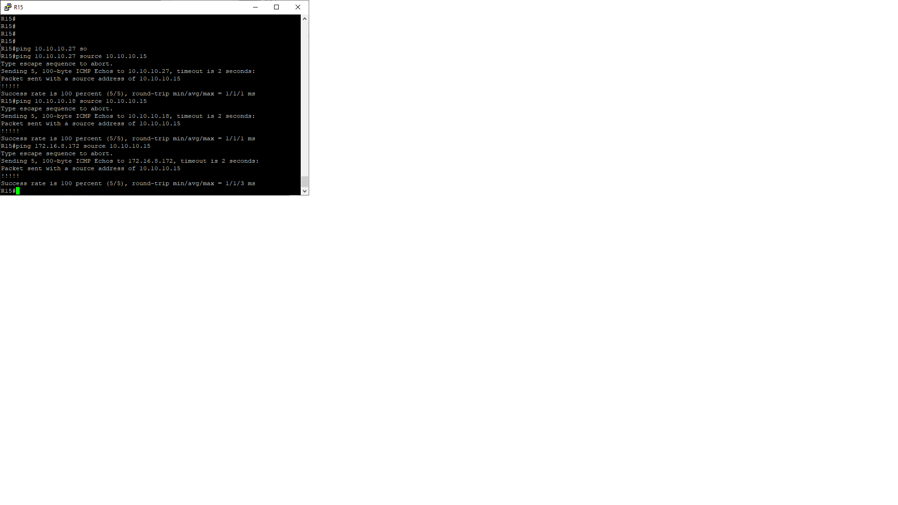
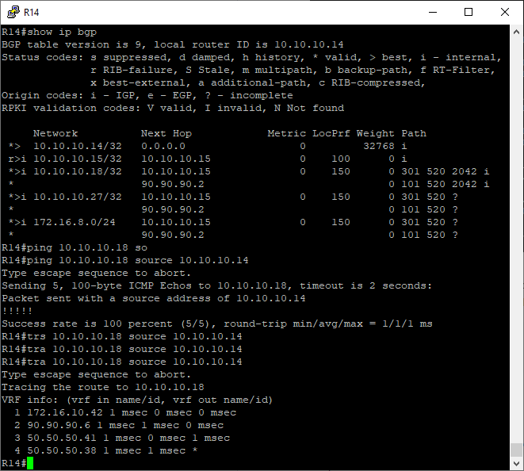

# Лабораторная работа №10
     
       
Адресный план указан тут https://github.com/skdm30/OTUS_Network_Engineers/tree/main/labs/lab4     
В данной работе необходимо:
1. Настроить iBGP в офисе Москва
2. Настроить iBGP в сети провайдера Триада
3. Настройте офис Москва так, чтобы приоритетным провайдером стал Ламас.    
4. Настройте офиса С.-Петербург так, чтобы трафик до любого офиса распределялся по двум линкам одновременно.
5. Организовать полную IP связанность всех сетей  

**1. Настроим на R14 и R15 iBGP:** 
``` 
R14#show run | s bgp
router bgp 1001
 bgp log-neighbor-changes
 neighbor 10.10.10.15 remote-as 1001
 neighbor 10.10.10.15 update-source Loopback0
 neighbor 90.90.90.2 remote-as 101
 !
 address-family ipv4
  network 10.10.10.14 mask 255.255.255.255
  neighbor 10.10.10.15 activate
  neighbor 90.90.90.2 activate
 exit-address-family
``` 

``` 
R15#show run | s bgp
router bgp 1001
 bgp log-neighbor-changes
 neighbor 10.10.10.14 remote-as 1001
 neighbor 10.10.10.14 update-source Loopback0
 neighbor 90.90.90.6 remote-as 301
 !
 address-family ipv4
  network 10.10.10.15 mask 255.255.255.255
  neighbor 10.10.10.14 activate
  neighbor 90.90.90.6 activate
 exit-address-family
``` 
**2. Настроим iBGP в провайдере Триада, с использованием RR:**  
В качестве RR выберем R23.  
``` 
R23#show run | s bgp
router bgp 520
 bgp log-neighbor-changes
 neighbor 10.10.10.24 remote-as 520
 neighbor 10.10.10.24 update-source Loopback0
 neighbor 10.10.10.24 route-reflector-client
 neighbor 10.10.10.24 next-hop-self
 neighbor 10.10.10.25 remote-as 520
 neighbor 10.10.10.25 update-source Loopback0
 neighbor 10.10.10.25 route-reflector-client
 neighbor 10.10.10.25 next-hop-self
 neighbor 10.10.10.26 remote-as 520
 neighbor 10.10.10.26 update-source Loopback0
 neighbor 10.10.10.26 route-reflector-client
 neighbor 10.10.10.26 next-hop-self
``` 

``` 
R24#show run | s bgp
router bgp 520
 bgp log-neighbor-changes
 neighbor 10.10.10.23 remote-as 520
 neighbor 10.10.10.23 update-source Loopback0
 neighbor 50.50.50.38 remote-as 2042
 neighbor 50.50.50.42 remote-as 301
 !
 address-family ipv4
  neighbor 10.10.10.23 activate
  neighbor 10.10.10.23 next-hop-self
  neighbor 50.50.50.38 activate
  neighbor 50.50.50.42 activate
 exit-address-family
``` 
``` 
R25#show run | s bgp
router bgp 520
 bgp log-neighbor-changes
 redistribute static
 neighbor 10.10.10.23 remote-as 520
 neighbor 10.10.10.23 update-source Loopback0
 neighbor 10.10.10.23 next-hop-self
``` 

``` 
R26#show run | s bgp
router bgp 520
 bgp log-neighbor-changes
 redistribute static
 neighbor 10.10.10.23 remote-as 520
 neighbor 10.10.10.23 update-source Loopback0
 neighbor 10.10.10.23 next-hop-self
 neighbor 50.50.50.34 remote-as 2042
``` 

Для проверки результата, вызовем команду *show ip bgp sum*:    
```    
R23#show ip bgp summary
BGP router identifier 10.10.10.23, local AS number 520
BGP table version is 6, main routing table version 6
5 network entries using 700 bytes of memory
6 path entries using 480 bytes of memory
3/3 BGP path/bestpath attribute entries using 432 bytes of memory
2 BGP AS-PATH entries using 48 bytes of memory
0 BGP route-map cache entries using 0 bytes of memory
0 BGP filter-list cache entries using 0 bytes of memory
BGP using 1660 total bytes of memory
BGP activity 5/0 prefixes, 6/0 paths, scan interval 60 secs

Neighbor        V           AS MsgRcvd MsgSent   TblVer  InQ OutQ Up/Down  State/PfxRcd
10.10.10.24     4          520     184     185        6    0    0 02:43:10        3
10.10.10.25     4          520     184     186        6    0    0 02:43:13        1
10.10.10.26     4          520     182     186        6    0    0 02:43:00        2
```    

```    
R26#show ip bgp summary
BGP router identifier 10.10.10.26, local AS number 520
BGP table version is 7, main routing table version 7
5 network entries using 700 bytes of memory
6 path entries using 480 bytes of memory
5/4 BGP path/bestpath attribute entries using 720 bytes of memory
2 BGP rrinfo entries using 48 bytes of memory
2 BGP AS-PATH entries using 48 bytes of memory
0 BGP route-map cache entries using 0 bytes of memory
0 BGP filter-list cache entries using 0 bytes of memory
BGP using 1996 total bytes of memory
BGP activity 5/0 prefixes, 6/0 paths, scan interval 60 secs

Neighbor        V           AS MsgRcvd MsgSent   TblVer  InQ OutQ Up/Down  State/PfxRcd
10.10.10.23     4          520     186     182        7    0    0 02:43:05        4
50.50.50.34     4         2042      32      34        7    0    0 00:22:51        1
```    
Видно, что R23 (который является RR) имеет соседские отношения со всеми роутерами в AS, а остольные только с R23.      
Доступность всех офисов проверим, отправив *ping* с R15:       
    

**3. Настроим офис Москва так, чтобы приоритетным провайдером стал Ламас**    
Будем использовать Local-preference на R15 в сторону провайдера R21 (Ламас), тем самым сделаем R21 приорететным и для R14, и R15.    
```    
route-map LP-150 permit 10
 set local-preference 150
```    
```    
router bgp 1001
 bgp log-neighbor-changes
 neighbor 10.10.10.14 remote-as 1001
 neighbor 10.10.10.14 update-source Loopback0
 neighbor 90.90.90.6 remote-as 301
 !
 address-family ipv4
  network 10.10.10.15 mask 255.255.255.255
  neighbor 10.10.10.14 activate
  neighbor 10.10.10.14 next-hop-self
  neighbor 10.10.10.14 soft-reconfiguration inbound
  neighbor 90.90.90.6 activate
  neighbor 90.90.90.6 route-map LP-150 in
  neighbor 90.90.90.6 filter-list 100 in
 exit-address-family
```    
Для проверки результата выполним *traceroute* c 10.10.10.14 (R14 Москва) до 10.10.10.18 (R18 СПБ)        
 
