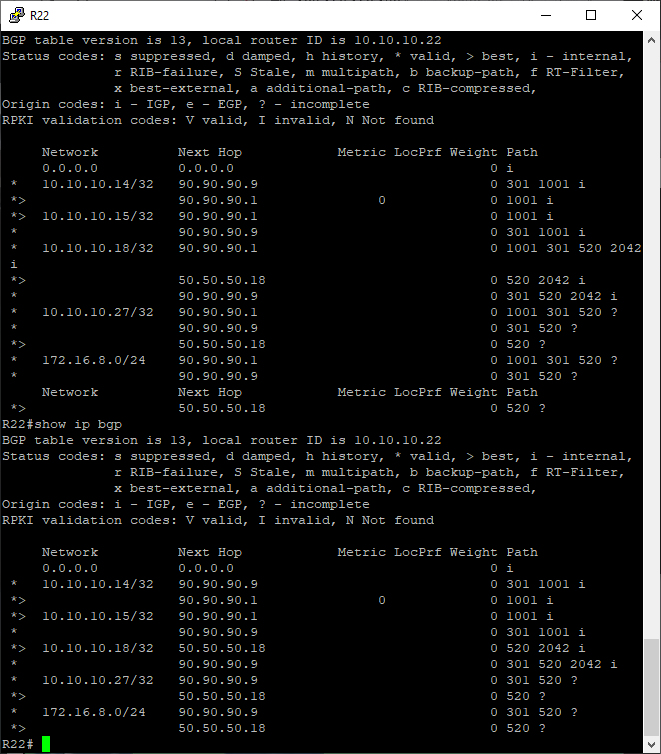

# Лабораторная работа №11
     
       
Адресный план указан тут https://github.com/skdm30/OTUS_Network_Engineers/tree/main/labs/lab4     

В данной работе в офисе Чокурдах необходимо настроить маршрутизацию на основи политик *PBR*  

**Описание/Пошаговая инструкция выполнения домашнего задания:** 
 1. Настроить фильтрацию в офисе Москва так, чтобы не появилось транзитного трафика(As-path).
 2. Настроить фильтрацию в офисе С.-Петербург так, чтобы не появилось транзитного трафика(Prefix-list).
 3. Настроить провайдера Киторн так, чтобы в офис Москва отдавался только маршрут по умолчанию.
 4. Настроить провайдера Ламас так, чтобы в офис Москва отдавался только маршрут по умолчанию и префикс офиса С.-Петербург.
 5. Все сети в лабораторной работе должны иметь IP связность.  
 
**Ход выполнения работы** 
**1.** Для фильтрации транзитного трафика в AS1001 решено отфильровать все внутренние маршруты AS провайдеров на граничных маршрутизаторах R14 и R15:     

**R14**
```   
router bgp 1001
 bgp log-neighbor-changes
 neighbor 10.10.10.15 remote-as 1001
 neighbor 10.10.10.15 update-source Loopback0
 neighbor 90.90.90.2 remote-as 101
 !
 address-family ipv4
  network 10.10.10.14 mask 255.255.255.255
  neighbor 10.10.10.15 activate
  neighbor 10.10.10.15 next-hop-self
  neighbor 10.10.10.15 soft-reconfiguration inbound
  neighbor 90.90.90.2 activate
  neighbor 90.90.90.2 filter-list 100 in
 exit-address-family

ip as-path access-list 100 permit ^$      
ip as-path access-list 100 deny .*
```   
**R15** 
``` 
router bgp 1001
 bgp log-neighbor-changes
 neighbor 10.10.10.14 remote-as 1001
 neighbor 10.10.10.14 update-source Loopback0
 neighbor 90.90.90.6 remote-as 301
 !
 address-family ipv4
  network 10.10.10.15 mask 255.255.255.255
  neighbor 10.10.10.14 activate
  neighbor 10.10.10.14 next-hop-self
  neighbor 10.10.10.14 soft-reconfiguration inbound
  neighbor 90.90.90.6 activate
  neighbor 90.90.90.6 route-map LP-150 in
  neighbor 90.90.90.6 filter-list 100 in
 exit-address-family

ip as-path access-list 100 permit .*ip as-path access-list 100 permit ^$      
ip as-path access-list 100 deny .*
```     
Выполнив команду *show ip bgp* на R22, увидим, что через AS1001 не проходит транзитный трафик. (На скриншоте также присутствует результат этой команды до применения фильтрации)



