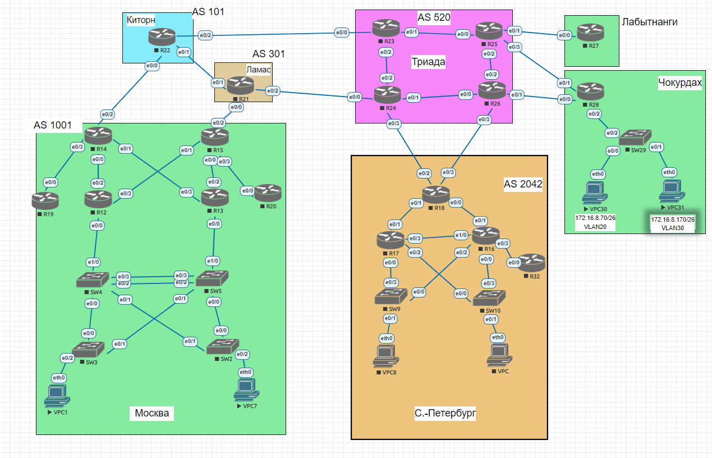

# Лабораторная работа №4 
   
**Общая таблица сетей.**

| Network IPv4     |        Network IPv6        | Description              | VLAN                |               |
|-----------------:|:---------------------------|-------------------------:|:--------------------|---------------|
| 172.16.0.0/21    |  20FF:AAAA:BBBB:A1::/64    | Москва.                  |                     |               |
| 172.16.0.0/24    |                            | Сеть управления.         | 10                  |               |
| 172.16.1.0/24    |                            | Отдел IT                 | 20                  |               |
| 172.16.2.0/24    |                            | SALES                    | 30                  |               |
| 172.16.3.0/24    |                            | Резерв.                  |                     |               |
| 172.16.4.0/24    |                            | Резерв.                  |                     |               |
| 172.16.5.0/24    |                            | Резерв.                  |                     |               |
| 172.16.6.0/24    |                            | Резерв.                  |                     |               |
| 172.16.7.0/24    |                            | Резерв.                  |                     |               |
| 172.26.0.0/22    |  20FF:AAAA:BBBB:A2::/64    | Санкт-Петербург          |                     |               |
| 172.26.1.0/24    |                            | Сеть управления          | 10                  |               |
| 172.26.2.0/24    |                            | Отдел IT                 | 20                  |               |
| 172.26.3.0/24    |                            | SALES                    | 30                  |               |
| 172.26.4.0/24    |                            | Резерв.                  |                     |               |
| 172.26.5.0/24    |                            | Резерв.                  |                     |               |
| 172.26.6.0/24    |                            | Резерв.                  |                     |               |
| 172.26.7.0/24    |                            | Резерв.                  |                     |               |
| 172.16.8.0/24    |  20FF:AAAA:BBBB:A3::/64    | Чокурдах                 |                     |               |
| 172.16.8.0/26    |                            | Сеть управления          | 10                  |               |
| 172.16.8.64/26   |                            | Отдел IT                 | 20                  |               |
| 172.16.8.128/26  |                            | SALES                    | 30                  |               |
| 172.16.8.192/26  |                            | Резерв.                  |                     |               |
| 172.16.9.0/24    |                            | Резерв.                  |                     |               |


**Сети Point-To-Point**


| host | Port  | IPv4 address |   Network       |    IPv6 address             | IPv6 LL address | Description  |
|------|-------|--------------|-----------------|-----------------------------|-----------------|--------------|
| R12  | e0/0  |              |                 |20FF:AAAA:BBBB:A1::0012:0/64 |  FE80::12       |              |   
| R12  | e0/1  | 172.16.10.37 | 172.16.10.36/30 |20FF:AAAA:BBBB:A1::0012:1/64 |  FE80::12       | to R13 e0/1  |   
| R12  | e0/2  | 172.16.10.1  | 172.16.10.0/30  |20FF:AAAA:BBBB:A1::0012:2/64 |  FE80::12       | to R14 e0/0  |  
| R12  | e0/3  | 172.16.10.5  | 172.216.10.4/30 |20FF:AAAA:BBBB:A1::0012:3/64 |  FE80::12       | to R15 e0/1  |  
| R13  | e0/0  |              |                 |20FF:AAAA:BBBB:A1::0013:0/64 |  FE80::13       |              |    
| R13  | e0/1  | 172.16.10.38 | 172.16.10.36/30 |20FF:AAAA:BBBB:A1::0013:1/64 |  FE80::13       | to R12 e0/1  |    
| R13  | e0/2  | 172.16.10.9  | 172.16.10.8/30  |20FF:AAAA:BBBB:A1::0013:2/64 |  FE80::13       | to R15 e0/0  |  
| R13  | e0/3  | 172.16.10.13 | 172.16.10.12/30 |20FF:AAAA:BBBB:A2::0013:3/64 |  FE80::13       | to R14 e0/1  |  
| R14  | e0/0  | 172.16.10.2  | 172.16.10.0/30  |20FF:AAAA:BBBB:A1::0014:0/64 |  FE80::14       | to R12 e0/2  |  
| R14  | e0/1  | 172.16.10.14 | 172.16.10.12/30 |20FF:AAAA:BBBB:A2::0014:1/64 |  FE80::14       | to R13 e0/3  |    
| R14  | e0/2  | 90.90.90.1   | 90.90.90.0 /30  |20FF:1111:1111:A1::0014:2/64 |  FE80::14       | to R22 e0/0  | -> Kitorn
| R14  | e0/3  | 172.16.10.17 | 172.16.10.16/30 |20FF:AAAA:BBBB:A3::0014:3/64 |  FE80::14       | to R19 e0/0  |
| R14  | e1/0  | 172.16.10.41 | 172.16.10.40/30 |20FF:AAAA:BBBB:A4::0014:4/64 |  FE80::14       | to R15 e1/0  |
| R15  | e0/0  | 172.16.10.10 | 172.16.10.8/30  |20FF:AAAA:BBBB:A1::0015:0/64 |  FE80::15       | to R13 e0/2  |  
| R15  | e0/1  | 172.16.10.6  | 172.16.10.4/30  |20FF:AAAA:BBBB:A2::0015:1/64 |  FE80::15       | to R12 e0/3  |  
| R15  | e0/2  | 90.90.90.5   | 90.90.90.4/30   |20FF:1111:1111:A1::0015:2/64 |  FE80::15       | to R21 e0/0  | -> Lamas
| R15  | e0/3  | 172.16.10.21 | 172.16.10.20/30 |20FF:AAAA:BBBB:A3::0015:3/64 |  FE80::15       | to R20 e0/0  |  
| R15  | e1/0  | 172.16.10.42 | 172.16.10.40/30 |20FF:AAAA:BBBB:A4::0015:4/64 |  FE80::14       | to R19 e0/0  |
| R16  | e0/0  |              |                 |20FF:BBBB:BBBB:A1::0016:0/64 |  FE80::16       |              |   
| R16  | e0/1  | 172.16.10.25 | 172.16.10.24/30 |20FF:BBBB:BBBB:A1::0016:1/64 |  FE80::16       | to R18 e0/0  | 
| R16  | e0/2  |              |                 |20FF:BBBB:BBBB:A1::0016:2/64 |  FE80::16       |              |  
| R16  | e0/3  | 172.16.10.29 | 172.16.10.28/30 |20FF:BBBB:BBBB:A1::0016:3/64 |  FE80::16       | to R32 e0/0  |
| R16  | e1/0  | 172.16.10.34 | 172.16.10.32/30 |20FF:BBBB:BBBB:A1::0016:4/64 |  FE80::16       | to R17 e0/3  |
| R17  | e0/0  |              |                 |20FF:BBBB:BBBB:A1::0017:0/64 |  FE80::17       |              |    
| R17  | e0/1  | 172.16.10.29 | 172.16.10.28/30 |20FF:BBBB:BBBB:A1::0017:1/64 |  FE80::17       | to R18 e0/1  |    
| R17  | e0/2  |              |                 |20FF:BBBB:BBBB:A1::0017:2/64 |  FE80::17       |              |
| R17  | e0/3  | 172.16.10.33 | 172.16.10.32/30 |20FF:BBBB:BBBB:A1::0017:3/64 |  FE80::17       | to R16 e1/0  |
| R18  | e0/0  | 172.16.10.26 | 172.16.10.24/30 |20FF:BBBB:BBBB:A1::0018:0/64 |  FE80::18       | to R16 e0/1  |    
| R18  | e0/1  | 172.16.10.30 | 172.26.10.28/30 |20FF:BBBB:BBBB:A1::0018:1/64 |  FE80::18       | to R17 e0/1  |  
| R18  | e0/2  | 50.50.50.38  | 50.50.50.36/30  |20FF:BBBB:BBBB:A1::0018:2/64 |  FE80::18       | to R24 e0/3  |   
| R18  | e0/3  | 50.50.50.34  | 50.50.50.32/30  |20FF:BBBB:BBBB:A2::0018:3/64 |  FE80::18       | to R26 e0/3  |  
| R19  | e0/0  | 172.16.10.18 | 172.26.10.16/30 |20FF:AAAA:BBBB:A3::0019:/64  |  FE80::19       | to R14 e0/3  |  
| R20  | e0/0  | 172.16.10.22 | 172.26.10.20/30 |20FF:AAAA:BBBB:A3::0020:1/64 |  FE80::20       | to R15 e0/3  |  
| R21  | e0/0  | 90.90.90.6   | 90.90.90.4/30   |20FF:1111:1111:A1::0021:0/64 |  FE80::21       | to R15 e0/2  |  
| R21  | e0/1  | 90.90.90.9   | 90.90.90.8/30   |20FF:1111:1111:A2::0021:1/64 |  FE80::21       | to R22 e0/1  | 
| R21  | e0/2  | 90.90.90.13  | 90.90.90.12/30  |20FF:1111:1111:A3::0021:2/64 |  FE80::21       | to R24 e0/0  |  
| R22  | e0/0  | 90.90.90.2   | 90.90.90.0/30   |20FF:1111:1111:A1::0022:0/64 |  FE80::22       | to R14 e0/2  |  
| R22  | e0/1  | 90.90.90.10  | 90.90.90.8/30   |20FF:1111:1111:A2::0022:1/64 |  FE80::22       | to R21 e0/1  |  
| R22  | e0/2  | 50.50.50.42  | 50.50.50.40/30  |20FF:1111:1111:A4::0022:2/64 |  FE80::22       | to R23 e0/0  |  
| R23  | e0/0  | 50.50.50.18  | 50.50.50.16/30  |20FF:1111:1111:A4::0023:0/64 |  FE80::23       | to R22 e0/2  |  
| R23  | e0/1  | 50.50.50.1   | 50.50.50.0/30   |20FF:1111:1111:A1::0023:1/64 |  FE80::23       | to R25 e0/0  |  
| R23  | e0/2  | 50.50.50.5   | 50.50.50.4/30   |20FF:1111:1111:A2::0023:2/64 |  FE80::23       | to R24 e0/2  |  
| R24  | e0/0  | 50.50.50.41  | 50.50.50.40/30  |20FF:1111:1111:A1::0024:0/64 |  FE80::24       | to R21 e0/2  |  
| R24  | e0/1  | 50.50.50.9   | 50.50.50.8/30   |20FF:1111:1111:A3::0024:1/64 |  FE80::24       | to R26 e0/0  |  
| R24  | e0/2  | 50.50.50.6   | 50.50.50.4/30   |20FF:1111:1111:A2::0024:2/64 |  FE80::24       | to R23 e0/2  |  
| R24  | e0/3  | 50.50.50.37  | 50.50.50.36/30  |20FF:BBBB:BBBB:A1::0024:3/64 |  FE80::24       | to R18 e0/2  |  
| R25  | e0/0  | 50.50.50.2   | 50.50.50.0/30   |20FF:1111:1111:A1::0025:0/64 |  FE80::25       | to R23 e0/1  |  
| R25  | e0/1  | 50.50.50.21  | 50.50.50.20/30  |20FF:1111:1111:A27::0025:1/64 |  FE80::25       | to R27 e0/0  |  
| R25  | e0/2  | 50.50.50.13  | 50.50.50.12/30  |20FF:1111:1111:A26::0025:2/64 |  FE80::25       | to R26 e0/2  |  
| R25  | e0/3  | 50.50.50.25  | 50.50.50.24/30  |20FF:1111:1111:A25::0025:3/64 |  FE80::25       | to R28 e0/1  |  
| R26  | e0/0  | 50.50.50.10  | 50.50.50.8/30   |20FF:1111:1111:A3::0026:0/64 |  FE80::26       | to R24 e0/1  |  
| R26  | e0/1  | 50.50.50.29  | 50.50.50.28/30  |20FF:1111:1111:A10::0026:1/64 |  FE80::26       | to R28 e0/0  |  
| R26  | e0/2  | 50.50.50.14  | 50.50.50.12/30  |20FF:1111:1111:A26::0026:2/64 |  FE80::26       | to R25 e0/2  |  
| R26  | e0/3  | 50.50.50.33  | 50.50.50.32/30  |20FF:BBBB:BBBB:A2::0026:3/64 |  FE80::26       | to R18 e0/3  |  
| R27  | e0/0  |  50.50.50.22 | 50.50.50.20/30 |20FF:1111:1111:A27::0027:0/64 |  FE80::27       | to R25 e0/1  |  
| R28  | e0/0  | 50.50.50.30  | 50.50.50.28/30  |20FF:1111:1111:A10::0028:0/64 |  FE80::28       | to R26 e0/1  |  
| R28  | e0/1  | 50.50.50.26  | 50.50.50.24/30  |20FF:1111:1111:A25::0028:1/64 |  FE80::28       | to R25 e0/3  | 
| R32  | e0/0  | 172.16.10.22 | 172.26.10.20/30 |20FF:BBBB:BBBB:A1::0032:0/64 |  FE80::32       | to R15 e0/3  |  

## Настройка оборудования на примере Московского офисса.  
На коммутаторах настроен VLAN управления и VLANы для различных подразделений. Реализована технология RoS. 

***Настройка протоколо STP.***
Коммутатор SW4 был настроен как корневой для VLAN20, ниже приведен результат команды *show spannig tree*
```
VLAN0010
  Spanning tree enabled protocol ieee
  Root ID    Priority    24586
             Address     aabb.cc00.5000
             Cost        56
             Port        65 (Port-channel1)
             Hello Time   2 sec  Max Age 20 sec  Forward Delay 15 sec

  Bridge ID  Priority    32778  (priority 32768 sys-id-ext 10)
             Address     aabb.cc00.4000
             Hello Time   2 sec  Max Age 20 sec  Forward Delay 15 sec
             Aging Time  300 sec

Interface           Role Sts Cost      Prio.Nbr Type
------------------- ---- --- --------- -------- --------------------------------
Et0/0               Desg FWD 100       128.1    Shr
Et0/1               Desg FWD 100       128.2    Shr
Et1/0               Desg FWD 100       128.5    Shr
Et1/1               Desg FWD 100       128.6    Shr
Po1                 Root FWD 56        128.65   Shr

VLAN0020
  Spanning tree enabled protocol ieee
  Root ID    Priority    24596
             Address     aabb.cc00.4000
             This bridge is the root
             Hello Time   2 sec  Max Age 20 sec  Forward Delay 15 sec

  Bridge ID  Priority    24596  (priority 24576 sys-id-ext 20)
             Address     aabb.cc00.4000
             Hello Time   2 sec  Max Age 20 sec  Forward Delay 15 sec
             Aging Time  300 sec

Interface           Role Sts Cost      Prio.Nbr Type
------------------- ---- --- --------- -------- --------------------------------
Et0/0               Desg FWD 100       128.1    Shr
Et0/1               Desg FWD 100       128.2    Shr
Et1/0               Desg FWD 100       128.5    Shr
Et1/1               Desg FWD 100       128.6    Shr
Po1                 Desg FWD 56        128.65   Shr

VLAN0030
  Spanning tree enabled protocol ieee
  Root ID    Priority    24606
             Address     aabb.cc00.5000
             Cost        56
             Port        65 (Port-channel1)
             Hello Time   2 sec  Max Age 20 sec  Forward Delay 15 sec

  Bridge ID  Priority    32798  (priority 32768 sys-id-ext 30)
             Address     aabb.cc00.4000
             Hello Time   2 sec  Max Age 20 sec  Forward Delay 15 sec
             Aging Time  300 sec

Interface           Role Sts Cost      Prio.Nbr Type
------------------- ---- --- --------- -------- --------------------------------
Et0/0               Desg FWD 100       128.1    Shr
Et0/1               Desg FWD 100       128.2    Shr
Et1/0               Desg FWD 100       128.5    Shr
Et1/1               Desg FWD 100       128.6    Shr
Po1                 Root FWD 56        128.65   Shr
```

Коммутатор SW5 был настроен как корневой для VLAN10 и VLAN30, ниже приведен результат команды *show spannig tree*
```
VLAN0010
  Spanning tree enabled protocol ieee
  Root ID    Priority    24586
             Address     aabb.cc00.5000
             This bridge is the root
             Hello Time   2 sec  Max Age 20 sec  Forward Delay 15 sec

  Bridge ID  Priority    24586  (priority 24576 sys-id-ext 10)
             Address     aabb.cc00.5000
             Hello Time   2 sec  Max Age 20 sec  Forward Delay 15 sec
             Aging Time  300 sec

Interface           Role Sts Cost      Prio.Nbr Type
------------------- ---- --- --------- -------- --------------------------------
Et0/0               Desg FWD 100       128.1    Shr
Et0/1               Desg FWD 100       128.2    Shr
Et1/0               Desg FWD 100       128.5    Shr
Et1/1               Desg FWD 100       128.6    Shr
Po1                 Desg FWD 56        128.65   Shr


VLAN0020
  Spanning tree enabled protocol ieee
  Root ID    Priority    24596
             Address     aabb.cc00.4000
             Cost        56
             Port        65 (Port-channel1)
             Hello Time   2 sec  Max Age 20 sec  Forward Delay 15 sec

  Bridge ID  Priority    32788  (priority 32768 sys-id-ext 20)
             Address     aabb.cc00.5000
             Hello Time   2 sec  Max Age 20 sec  Forward Delay 15 sec
             Aging Time  300 sec

Interface           Role Sts Cost      Prio.Nbr Type
------------------- ---- --- --------- -------- --------------------------------
Et0/0               Desg FWD 100       128.1    Shr
Et0/1               Desg FWD 100       128.2    Shr
Et1/0               Desg FWD 100       128.5    Shr
Et1/1               Desg FWD 100       128.6    Shr
Po1                 Root FWD 56        128.65   Shr


VLAN0030
  Spanning tree enabled protocol ieee
  Root ID    Priority    24606
             Address     aabb.cc00.5000
             This bridge is the root
             Hello Time   2 sec  Max Age 20 sec  Forward Delay 15 sec

  Bridge ID  Priority    24606  (priority 24576 sys-id-ext 30)
             Address     aabb.cc00.5000
             Hello Time   2 sec  Max Age 20 sec  Forward Delay 15 sec
             Aging Time  300 sec

Interface           Role Sts Cost      Prio.Nbr Type
------------------- ---- --- --------- -------- --------------------------------
Et0/0               Desg FWD 100       128.1    Shr
Et0/1               Desg FWD 100       128.2    Shr
Et1/0               Desg FWD 100       128.5    Shr
Et1/1               Desg FWD 100       128.6    Shr
Po1                 Desg FWD 56        128.65   Shr

```
Ниже приведены данные о настройке STP на коммутаторах SW3 и SW2.

SW3
```
VLAN0010
  Spanning tree enabled protocol ieee
  Root ID    Priority    24586
             Address     aabb.cc00.5000
             Cost        100
             Port        2 (Ethernet0/1)
             Hello Time   2 sec  Max Age 20 sec  Forward Delay 15 sec

  Bridge ID  Priority    32778  (priority 32768 sys-id-ext 10)
             Address     aabb.cc00.3000
             Hello Time   2 sec  Max Age 20 sec  Forward Delay 15 sec
             Aging Time  300 sec

Interface           Role Sts Cost      Prio.Nbr Type
------------------- ---- --- --------- -------- --------------------------------
Et0/0               Altn BLK 100       128.1    Shr
Et0/1               Root FWD 100       128.2    Shr


VLAN0020
  Spanning tree enabled protocol ieee
  Root ID    Priority    24596
             Address     aabb.cc00.4000
             Cost        100
             Port        1 (Ethernet0/0)
             Hello Time   2 sec  Max Age 20 sec  Forward Delay 15 sec

  Bridge ID  Priority    32788  (priority 32768 sys-id-ext 20)
             Address     aabb.cc00.3000
             Hello Time   2 sec  Max Age 20 sec  Forward Delay 15 sec
             Aging Time  300 sec

Interface           Role Sts Cost      Prio.Nbr Type
------------------- ---- --- --------- -------- --------------------------------
Et0/0               Root FWD 100       128.1    Shr
Et0/1               Altn BLK 100       128.2    Shr
Et0/2               Desg FWD 100       128.3    Shr Edge


VLAN0030
  Spanning tree enabled protocol ieee
  Root ID    Priority    24606
             Address     aabb.cc00.5000
             Cost        100
             Port        2 (Ethernet0/1)
             Hello Time   2 sec  Max Age 20 sec  Forward Delay 15 sec

  Bridge ID  Priority    32798  (priority 32768 sys-id-ext 30)
             Address     aabb.cc00.3000
             Hello Time   2 sec  Max Age 20 sec  Forward Delay 15 sec
             Aging Time  300 sec

Interface           Role Sts Cost      Prio.Nbr Type
------------------- ---- --- --------- -------- --------------------------------
Et0/0               Altn BLK 100       128.1    Shr
Et0/1               Root FWD 100       128.2    Shr
```
SW2
```
VLAN0010
  Spanning tree enabled protocol ieee
  Root ID    Priority    24586
             Address     aabb.cc00.5000
             Cost        100
             Port        1 (Ethernet0/0)
             Hello Time   2 sec  Max Age 20 sec  Forward Delay 15 sec

  Bridge ID  Priority    32778  (priority 32768 sys-id-ext 10)
             Address     aabb.cc00.2000
             Hello Time   2 sec  Max Age 20 sec  Forward Delay 15 sec
             Aging Time  15  sec

Interface           Role Sts Cost      Prio.Nbr Type
------------------- ---- --- --------- -------- --------------------------------
Et0/0               Root FWD 100       128.1    Shr
Et0/1               Altn BLK 100       128.2    Shr


VLAN0020
  Spanning tree enabled protocol ieee
  Root ID    Priority    24596
             Address     aabb.cc00.4000
             Cost        100
             Port        2 (Ethernet0/1)
             Hello Time   2 sec  Max Age 20 sec  Forward Delay 15 sec

  Bridge ID  Priority    32788  (priority 32768 sys-id-ext 20)
             Address     aabb.cc00.2000
             Hello Time   2 sec  Max Age 20 sec  Forward Delay 15 sec
             Aging Time  15  sec

Interface           Role Sts Cost      Prio.Nbr Type
------------------- ---- --- --------- -------- --------------------------------
Et0/0               Altn BLK 100       128.1    Shr
Et0/1               Root FWD 100       128.2    Shr


VLAN0030
  Spanning tree enabled protocol ieee
  Root ID    Priority    24606
             Address     aabb.cc00.5000
             Cost        100
             Port        1 (Ethernet0/0)
             Hello Time   2 sec  Max Age 20 sec  Forward Delay 15 sec

  Bridge ID  Priority    32798  (priority 32768 sys-id-ext 30)
             Address     aabb.cc00.2000
             Hello Time   2 sec  Max Age 20 sec  Forward Delay 15 sec
             Aging Time  15  sec

Interface           Role Sts Cost      Prio.Nbr Type
------------------- ---- --- --------- -------- --------------------------------
Et0/0               Root FWD 100       128.1    Shr
Et0/1               Altn BLK 100       128.2    Shr
Et0/2               Desg FWD 100       128.3    Shr

```


Также была настроена агрегация каналов по протоколу PAgP на
коммутаторе SW4:
```
Group  Port-channel  Protocol    Ports
------+-------------+-----------+-----------------------------------------------
1      Po1(SU)         PAgP      Et0/2(P)    Et0/3(P)

```
и коммутаторе SW5:
```
Group  Port-channel  Protocol    Ports
------+-------------+-----------+-----------------------------------------------
1      Po1(SU)         PAgP      Et0/2(P)    Et0/3(P)
```

**Настройка протокола HSRP на маршрутизаторах R12 и R13** 
Вывод команды *show standby brief* на R12:
```
Interface   Grp  Pri P State   Active          Standby         Virtual IP
Et0/0.10    1    100   Standby 172.16.0.22     local           172.16.0.254
Et0/0.20    2    150 P Active  local           172.16.1.22     172.16.1.254
Et0/0.30    3    100   Standby 172.16.2.22     local           172.16.2.254
``` 
Вывод команды *show standby brief* на R13:
```
Interface   Grp  Pri P State   Active          Standby         Virtual IP
Et0/0.10    1    200 P Active  local           172.16.0.1      172.16.0.254
Et0/0.20    2    100   Standby 172.16.1.1      local           172.16.1.254
Et0/0.30    3    150 P Active  local           172.16.2.1      172.16.2.254
``` 

Полные настройки оборудования в Московском офиссе приведены здесь:
[SW2](config/setting_SW2) 
[SW3](config/setting_SW3) 
[SW4](config/setting_SW4) 
[SW5](config/setting_SW5) 
[R12](config/setting_R12) 
[R13](config/setting_R13) 

Подобным образом настроено обородувание в офисах СПБ и Чокурдах.
