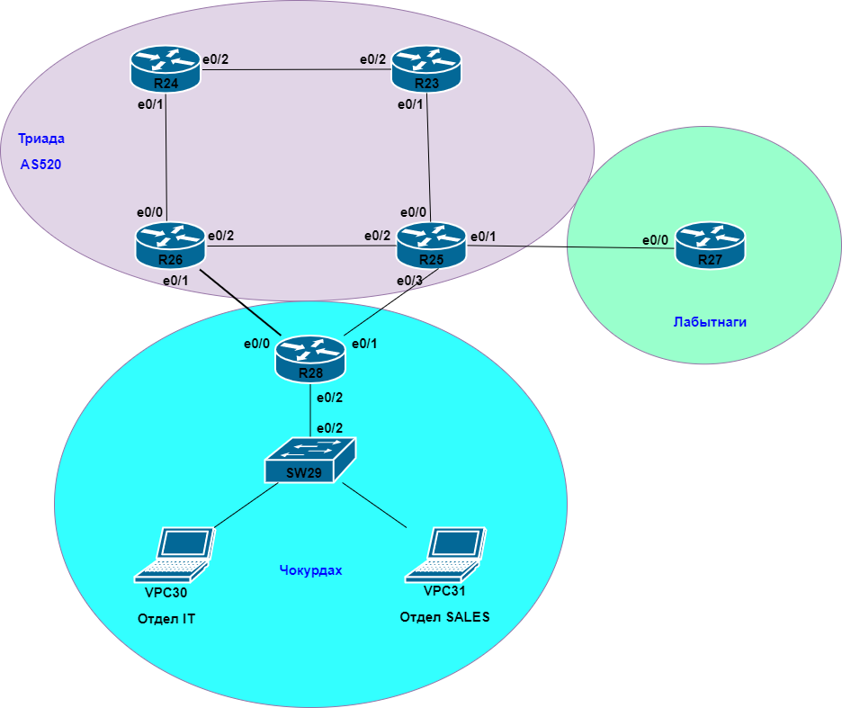
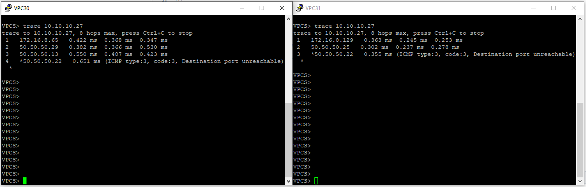
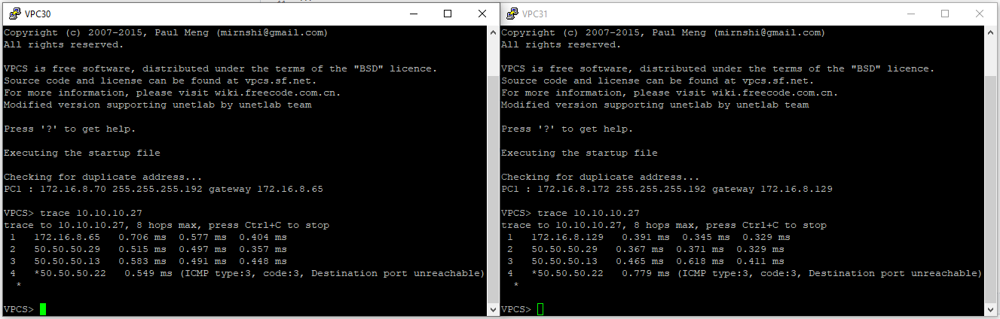
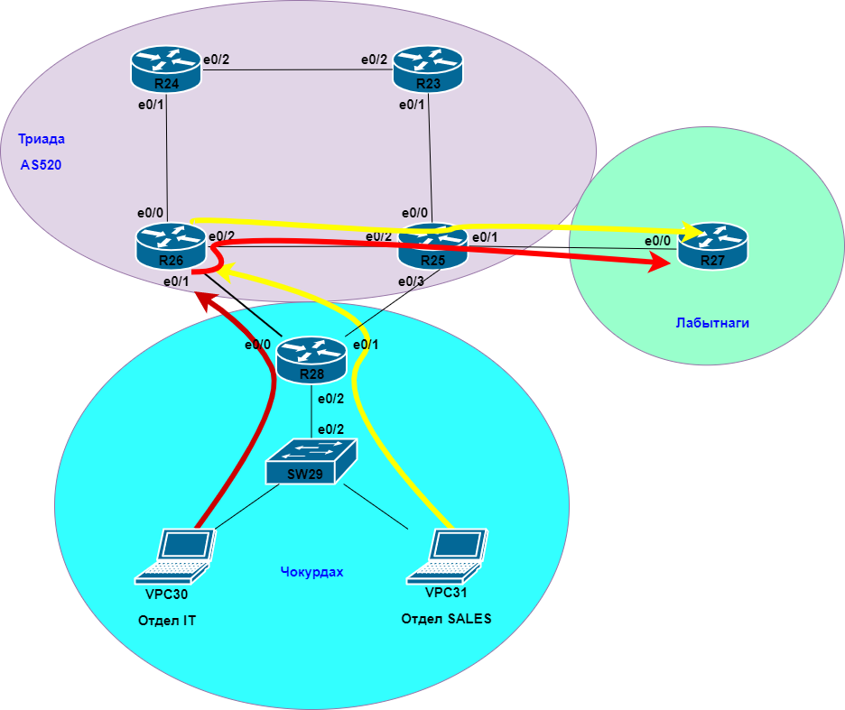
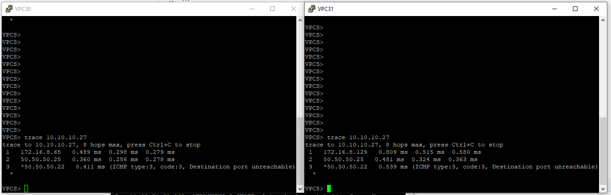
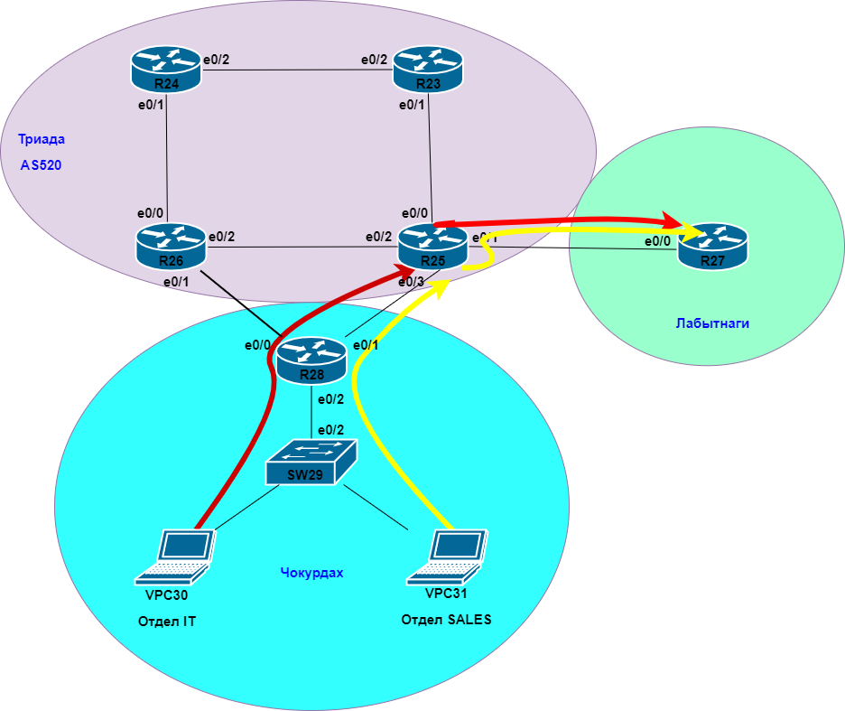

# Лабораторная работа №5 
     
       

В данной работе в офисе Чокурдах необходимо настроить маршрутизацию на основи политик *PBR*  

**Описание/Пошаговая инструкция выполнения домашнего задания:** 
- Настроите политику маршрутизации для сетей офиса.
- Распределите трафик между двумя линками с провайдером.
- Настроите отслеживание линка через технологию IP SLA.(только для IPv4)
- Настройте для офиса Лабытнанги маршрут по-умолчанию.

**Ход выполнения работы** 
В офисе Чокурдах решено разделить исходящий трафик к провайдеру по двум линкам: 
- трафик отдела IT (Laptop VPC30) идет через линк R28-R25; 
- трафик отдела SALES (Laptop VPC31) идет через линк R28-R26. 
 
Также предусмотрено переключение маршрутов до провайдера в случае отключения одного из линков.  
Т.е. в этом случае трафик от обоих отделов пойдет по одному маршруту.  

Ниже приведена часть настроек. 
Настройка ACL: 
``` 
ip access-list extended ACL_IT_to_R26
 permit ip 172.16.8.64 0.0.0.63 any
 deny   ip any any
ip access-list extended ACL_SALES_to_R25
 permit ip 172.16.8.128 0.0.0.63 any
 deny   ip any any
``` 
Настройка ROUTE-MAP:  
``` 
route-map PBR_TO_R25_R26 permit 10
 match ip address ACL_IT_to_R26
 set ip next-hop verify-availability 50.50.50.29 10 track 1
 set ip next-hop verify-availability 50.50.50.25 20 track 2
!
route-map PBR_TO_R25_R26 permit 20
 match ip address ACL_SALES_to_R25
 set ip next-hop verify-availability 50.50.50.25 10 track 2
 set ip next-hop verify-availability 50.50.50.29 20 track 1
``` 
Настройка отслеживание линка с помощью IP SLA: 
``` 
ip sla 1
 icmp-echo 50.50.50.29 source-interface Ethernet0/0
 threshold 1000
 timeout 1500
 frequency 3
ip sla schedule 1 life forever start-time now
ip sla 2
 icmp-echo 50.50.50.25 source-interface Ethernet0/1
 threshold 1000
 timeout 1500
 frequency 3
ip sla schedule 2 life forever start-time now
``` 
Настройка TRACK: 
``` 
track 1 ip sla 1 reachability
 delay down 10 up 5
!
track 2 ip sla 2 reachability
 delay down 10 up 5
```    
На изображениях ниже приведены результаты *trace* при различных вариантах состояния линков с правайдером.       
Для примера пингуется Loopback адрес роутера R27 в Лабытнаги.
В первом случае все линки доступны, поэтому трафик от двух отедлов идет по разным маршрутам.      
 
       

Во втором случае нет линка до R25  
 
       

Во втором случае нет линка до R26 
 
 

На роутере R27 офиса Лабытнаги необходимо прописать default к провайдеру:    
```    
ip route 0.0.0.0 0.0.0.0 50.50.50.21      
```    
