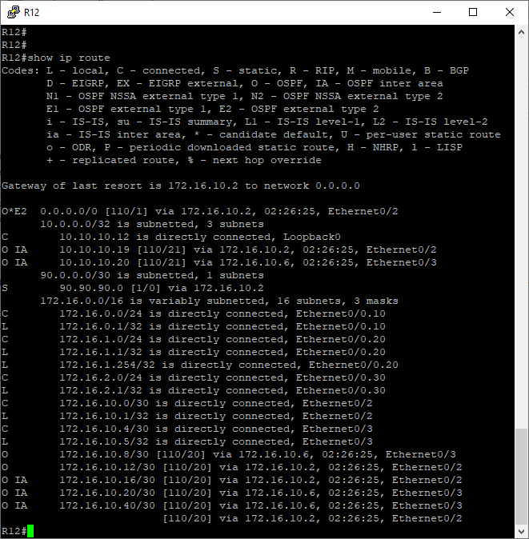

# Лабораторная работа №6 
В данной лабораторной работе необходимо выполнить требования: 
1.  Маршрутизаторы R14-R15 находятся в зоне 0 - backbone.
2.  Маршрутизаторы R12-R13 находятся в зоне 10. Дополнительно к маршрутам должны получать маршрут по умолчанию.
3.  Маршрутизатор R19 находится в зоне 101 и получает только маршрут по умолчанию.
4.  Маршрутизатор R20 находится в зоне 102 и получает все маршруты, кроме маршрутов до сетей зоны 101.
5.  Настройка для IPv6 повторяет логику IPv4. 
 Схема сети в московском офисе: 
    
Для наглядности, на каждом роутере настроен интерфейс *Loopback* c адресом *10.10.10.N*, где *N* номер роутера. Это нам позволит в качестве router-id использовать ip-address Loopback интерфейса.
Изменененные конфигурации [R14](config/setting_R14), [R15](config/setting_R15).
Ниже приведены результаты команд *show ip ospf int brief* и *show ip ospf neighbor*  R14 и R15:
  
  
Изменененные конфигурации [R12](config/setting_R12), [R13](config/setting_R13)  
На рисунке, представленном ниже, видно, что R12 дополнительно к маршрутам получает маршрут по умолчанию. Аналогично реализовано и на R13. 
  
Для выполнения требования №3 необходимо было провести следующие настройки:  
  - на R14 (является ABR для area 101) в настройка OSPF прописать *area 101 stub no-summary*, 
  - на R19 (из этой же зоны) *area 101 stub*. 
Результат виден на рисунке ниже - R19 получает только маршрут по умолчанию: 
  

Для выполнения требования №4 необходимо было провести следующие настройки:  
  - на R15 создать *prefix-list* (10.10.10.19/32 - Lo1 интерфейс R19, настроен для наглядности)
```
ip prefix-list FILTER-IN-AREA-102 seq 10 deny 172.16.10.16/30
ip prefix-list FILTER-IN-AREA-102 seq 15 deny 10.10.10.19/32
ip prefix-list FILTER-IN-AREA-102 seq 20 permit 0.0.0.0/0 le 32
```   
 - а также выполнить настройку  
 ```
 router ospf 1
 area 102 filter-list prefix FILTER-IN-AREA-102 in
``` 
В правильности настройки можно убедиться, если сравнить результаты выполнения команды *show ip route* на R20 до и после настройки (не виден маршрут до 10.10.10.19) 

  

  
Изменененные конфигурации [R19](config/setting_R19), [R20](config/setting_R20)  

Конфигурация OSPFv3 также проведена на всех роутерах. 
Результаты выполнения команды *show ipv6 route* 

