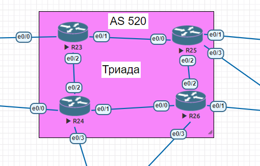

# Лабораторная работа №6 
  
В данной работе необходимо настроить протокол динамической маршрутизации *IS-IS*  

**Описание/Пошаговая инструкция выполнения домашнего задания:** 
1.  R23 и R25 находятся в зоне 2222.
2.  R24 находится в зоне 24.
3.  R26 находится в зоне 26.  

**Ход выполнения работы** 
Настроим IS-IS на R23 и R25 для зоны 2222:  
- для R23 значение net зададим *49.2222.0023.0023.0023.00*; 
- для R25 значение net зададим *49.2222.0025.0025.0025.00*.    
-  
Настроим IS-IS на R24 для зоны 24:  
- для R24 значение net зададим *49.0024.0024.0024.0024.00*;    
-  
Настроим IS-IS на R26 для зоны 26:  
- для R26 значение net зададим *49.0026.0026.0026.0026.00*;   
Включим протокол IS-IS на соответствующих интерфейсах роутеров. 
Результат настройки можно увидеть ниже: 

**Для R23:**
```
R23#show isis neighbors

System Id      Type Interface   IP Address      State Holdtime Circuit Id
R24            L2   Et0/2       50.50.50.6      UP    8        R24.01           
R25            L1   Et0/1       50.50.50.2      UP    8        R25.01           
R25            L2   Et0/1       50.50.50.2      UP    9        R25.01   

R23#show ip route isis
Codes: L - local, C - connected, S - static, R - RIP, M - mobile, B - BGP
       D - EIGRP, EX - EIGRP external, O - OSPF, IA - OSPF inter area
       N1 - OSPF NSSA external type 1, N2 - OSPF NSSA external type 2
       E1 - OSPF external type 1, E2 - OSPF external type 2
       i - IS-IS, su - IS-IS summary, L1 - IS-IS level-1, L2 - IS-IS level-2
       ia - IS-IS inter area, * - candidate default, U - per-user static route
       o - ODR, P - periodic downloaded static route, H - NHRP, l - LISP
       + - replicated route, % - next hop override

Gateway of last resort is not set

      50.0.0.0/8 is variably subnetted, 5 subnets, 2 masks
i L1     50.50.50.12/30 [115/20] via 50.50.50.2, 00:40:39, Ethernet0/1
```
**Для R25:**
```
R25#show isis neighbors

System Id      Type Interface   IP Address      State Holdtime Circuit Id
R23            L1   Et0/0       50.50.50.1      UP    29       R25.01           
R23            L2   Et0/0       50.50.50.1      UP    29       R25.01           
R26            L2   Et0/2       50.50.50.14     UP    9        R26.01 

R25#show ip route isis
Codes: L - local, C - connected, S - static, R - RIP, M - mobile, B - BGP
       D - EIGRP, EX - EIGRP external, O - OSPF, IA - OSPF inter area
       N1 - OSPF NSSA external type 1, N2 - OSPF NSSA external type 2
       E1 - OSPF external type 1, E2 - OSPF external type 2
       i - IS-IS, su - IS-IS summary, L1 - IS-IS level-1, L2 - IS-IS level-2
       ia - IS-IS inter area, * - candidate default, U - per-user static route
       o - ODR, P - periodic downloaded static route, H - NHRP, l - LISP
       + - replicated route, % - next hop override

Gateway of last resort is not set

      50.0.0.0/8 is variably subnetted, 5 subnets, 2 masks
i L1     50.50.50.4/30 [115/20] via 50.50.50.1, 00:39:56, Ethernet0/0
```       
**Для R24:**  
``` 
R24#show isis neighbors

System Id      Type Interface   IP Address      State Holdtime Circuit Id
R23            L2   Et0/2       50.50.50.5      UP    26       R24.01           
R24#show ip rout isis
Codes: L - local, C - connected, S - static, R - RIP, M - mobile, B - BGP
       D - EIGRP, EX - EIGRP external, O - OSPF, IA - OSPF inter area
       N1 - OSPF NSSA external type 1, N2 - OSPF NSSA external type 2
       E1 - OSPF external type 1, E2 - OSPF external type 2
       i - IS-IS, su - IS-IS summary, L1 - IS-IS level-1, L2 - IS-IS level-2
       ia - IS-IS inter area, * - candidate default, U - per-user static route
       o - ODR, P - periodic downloaded static route, H - NHRP, l - LISP
       + - replicated route, % - next hop override

Gateway of last resort is not set

      50.0.0.0/8 is variably subnetted, 6 subnets, 2 masks
i L2     50.50.50.0/30 [115/20] via 50.50.50.5, 00:59:48, Ethernet0/2
i L2     50.50.50.12/30 [115/30] via 50.50.50.5, 00:44:33, Ethernet0/2
```   
**Для R26:**  
``` 
R26#show isis neighbors

System Id      Type Interface   IP Address      State Holdtime Circuit Id
R25            L2   Et0/2       50.50.50.13     UP    22       R26.01     

R26#show ip route isis
Codes: L - local, C - connected, S - static, R - RIP, M - mobile, B - BGP
       D - EIGRP, EX - EIGRP external, O - OSPF, IA - OSPF inter area
       N1 - OSPF NSSA external type 1, N2 - OSPF NSSA external type 2
       E1 - OSPF external type 1, E2 - OSPF external type 2
       i - IS-IS, su - IS-IS summary, L1 - IS-IS level-1, L2 - IS-IS level-2
       ia - IS-IS inter area, * - candidate default, U - per-user static route
       o - ODR, P - periodic downloaded static route, H - NHRP, l - LISP
       + - replicated route, % - next hop override

Gateway of last resort is 150.50.50.6 to network 0.0.0.0

      50.0.0.0/8 is variably subnetted, 6 subnets, 2 masks
i L2     50.50.50.0/30 [115/20] via 50.50.50.13, 01:07:36, Ethernet0/2
i L2     50.50.50.4/30 [115/30] via 50.50.50.13, 00:41:00, Ethernet0/2
``` 


