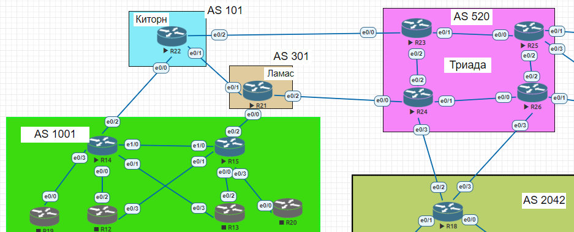

# Лабораторная работа №9 
     
       
Адресный план указан тут https://github.com/skdm30/OTUS_Network_Engineers/tree/main/labs/lab4     

В данной работе в необходимо настроить BGP между автономными системами.
Организовать доступность между офисами Москва и С.-Петербург.  

**Описание/Пошаговая инструкция выполнения домашнего задания:** 
1. Настроить eBGP между офисом Москва и двумя провайдерами - Киторн и Ламас.
2. Настроить eBGP между провайдерами Киторн и Ламас.
3. Настроить eBGP между Ламас и Триада.
4. Настроить eBGP между офисом С.-Петербург и провайдером Триада.
5. Организовать IP доступность между пограничным роутерами офисами Москва и С.-Петербург.

**Ход выполнения работы**        
Настройка R14 
``` 
R14#show run | s bg
router bgp 1001
 bgp log-neighbor-changes
 neighbor 10.10.10.15 remote-as 1001
 neighbor 10.10.10.15 update-source Loopback0
 neighbor 90.90.90.2 remote-as 101
 !
 address-family ipv4
  network 10.10.10.14 mask 255.255.255.255
  neighbor 10.10.10.15 activate
  neighbor 90.90.90.2 activate
 exit-address-family
```    
Настройка R15 
```    
router bgp 1001
 bgp log-neighbor-changes
 neighbor 10.10.10.14 remote-as 1001
 neighbor 10.10.10.14 update-source Loopback0
 neighbor 90.90.90.6 remote-as 301
 !
 address-family ipv4
  network 10.10.10.15 mask 255.255.255.255
  neighbor 10.10.10.14 activate
  neighbor 90.90.90.6 activate
 exit-address-family
```    
Настройка R21 
```    
router bgp 301
 bgp log-neighbor-changes
 neighbor 50.50.50.41 remote-as 520
 neighbor 90.90.90.5 remote-as 1001
 neighbor 90.90.90.10 remote-as 101
 !
 address-family ipv4
  neighbor 50.50.50.41 activate
  neighbor 90.90.90.5 activate
  neighbor 90.90.90.10 activate
 exit-address-family
```    
Настройка R22 
```    
router bgp 101
 bgp log-neighbor-changes
 neighbor 90.90.90.1 remote-as 1001
 neighbor 90.90.90.9 remote-as 301
 !
 address-family ipv4
  neighbor 90.90.90.1 activate
  neighbor 90.90.90.9 activate
 exit-address-family
```      
Настройка R24 
```    
router bgp 520
 bgp log-neighbor-changes
 neighbor 10.10.10.23 remote-as 520
 neighbor 10.10.10.23 update-source Loopback0
 neighbor 50.50.50.38 remote-as 2042
 neighbor 50.50.50.42 remote-as 301
 !
 address-family ipv4
  neighbor 10.10.10.23 activate
  neighbor 10.10.10.23 next-hop-self
  neighbor 50.50.50.38 activate
  neighbor 50.50.50.42 activate
 exit-address-family
```    
Настройка R18 
```    

router bgp 2042
 bgp log-neighbor-changes
 neighbor 50.50.50.37 remote-as 520
 !
 address-family ipv4
  network 10.10.10.18 mask 255.255.255.255
  neighbor 50.50.50.37 activate
 exit-address-family
```    
Связность Москвы и СПБ показывает прохождение пинга между Loopback интерфейсами пограничных маршрутов:   
![](pic/ping.png

